# Olist E-Commerce Analytics Platform


[](https://github.com/nhmTri/Brazilian_E_Commerce/actions/workflows/checks.yml)




A medallion pipeline over the public Olist dataset — 1.4M source rows in, a 99,441-row fact table
out — built on Databricks Free Edition with Delta Lake, Structured Streaming and SCD Type 2.

**The finding worth the build: late delivery predicts a bad review better than anything about the
product itself (r = 0.68).** Which moves the lever from catalogue quality to logistics SLA.

---

## Why the layers are shaped this way

### Dimensions are SCD Type 2, not SCD 1

A customer who moves city must keep their history, or last year's revenue silently re-reports
against this year's region. Delta `MERGE INTO` in the two-step pattern — expire the old version,
insert the new one — and the whole thing is idempotent: re-running creates no duplicates.
The engine is one reusable class rather than a copy of `apply_scd2()` in every notebook:
[`src/scd/scd2_engine.py`](src/scd/scd2_engine.py).

### Facts stream through `foreachBatch`

`foreachBatch` is what makes `MERGE INTO` legal inside a streaming context, which is what buys
exactly-once. Plain `writeStream` cannot do it.

### The data-quality gate is hand-written, and that turned out to matter

Delta Live Tables expectations are not available on Free Edition, so the framework is written out:
**critical rules drop the row, warn rules log it and let it through**, with a structured logger
that stamps every violation with a `run_id` and auto-samples offenders for debugging.

It paid for itself immediately. Two things it caught in supposedly clean public data:

- `review_score` containing timestamp strings
- `payment_value = 0` rows that are **not** corrupt — they are genuine free orders, so the rule
  had to be a warning rather than a drop

That second one is the argument for the whole design: a gate that only drops is a gate that
quietly deletes real revenue.

---

## The model

```
                    dim_date
                       │
dim_customer ──── fact_orders ──── dim_product
                       │
                    dim_seller
```

**`fact_orders`** — 99,441 rows

| Measure | Meaning |
|---|---|
| `payment_value` | Gross revenue, BRL |
| `net_revenue` | Revenue after freight |
| `lead_time_days` | Purchase to delivery |
| `is_delivered_on_time` | Actual vs estimated date |

Every dimension carries `valid_from`, `valid_to`, `is_current`.

## What came out of it

- **92.3%** of orders delivered on time
- São Paulo is fastest at **8.2 days** average
- The top five categories carry **41%** of revenue
- `health_beauty` has the highest average order value, around **R$180**
- Late delivery correlates with low review score at **r = 0.68**
- **73%** of orders are paid by credit card

## The business layer

Ten views, grouped by the question they answer rather than by the table they sit on.

| Group | View | Question |
|---|---|---|
| Revenue | `biz_revenue_daily` | Daily trend and month-on-month growth |
| Revenue | `biz_revenue_cohort` | Does retention hold by signup cohort? |
| Revenue | `biz_revenue_anomaly` | Z-score spike and drop detection |
| Ops | `biz_delivery_performance` | SLA by region |
| Ops | `biz_seller_scorecard` | Seller ranking |
| Ops | `biz_product_quality` | Quality by category |
| Ops | `biz_review_analysis` | The delivery-to-review correlation above |
| Customer | `biz_customer_rfm` | RFM segmentation |
| Customer | `biz_customer_ltv` | Lifetime value and churn risk |
| Customer | `biz_customer_journey` | Order funnel |

---

## Run it

**You need** a Databricks account (Free Edition is enough) and the seven CSVs from the
[Olist dataset on Kaggle](https://www.kaggle.com/datasets/olistbr/brazilian-ecommerce).

```bash
# 1. clone this repo into Databricks Repos
# 2. upload the CSVs to a Unity Catalog volume:
#      /Volumes/olist_ecommerce/bronze/raw_files/
# 3. run the notebooks in order
```

| Order | Notebook | Builds |
|---|---|---|
| 1 | `notebooks/docs/01_bronze_ingest.ipynb` | Bronze — 9 raw Delta tables |
| 2 | `notebooks/docs/02_silver_transform.ipynb` | Silver — 8 cleansed tables, DQ framework |
| 3 | `notebooks/docs/03_gold_dim_scd2.ipynb` | Gold dimensions, SCD2 |
| 4 | `notebooks/docs/04_gold_fact_streaming.ipynb` | Gold fact, streaming |
| 5 | `notebooks/docs/05_business_views.ipynb` | The ten views |

## Repo map

```
notebooks/docs/    the five pipeline notebooks, in run order
src/common/        config, structured logger, helpers
src/scd/           the reusable SCD2 engine
assets/            the architecture diagram
```

## Stack

| Layer | Choice | Why |
|---|---|---|
| Platform | Databricks Free Edition | Unified compute and catalogue |
| Storage | Delta Lake | ACID, time travel, the SCD2 merge |
| Processing | PySpark | Distributed transforms |
| Governance | Unity Catalog | Volumes, lineage |
| Streaming | Structured Streaming | Near-real-time facts |
| Modelling | Kimball star schema | Dimensional modelling |
| Serving | SQL views | The business layer |

---

Every row here comes from the public Olist dataset. No client data, client names or client figures
appear in this repository.
